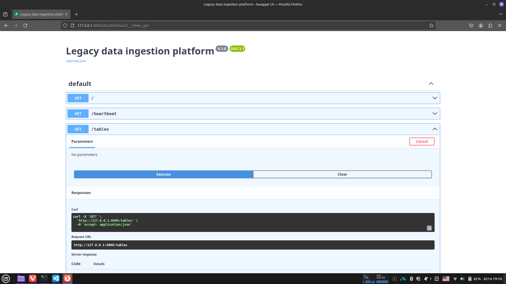

# Coding challenge - backend services

## Description
This package provides a backend REST API system to deploy in a production environment, that allows the user to load a number of historical data tables, in CSV format, to an arbitrary defined transacional SQL database.
The requirements outline a system of 3 tables (`jobs`, `departments`, and `hiredemployees`) that need to be filled with historical data coming from CSV files. Given that the developer has to select the source of the files, a two-way system was designed: an API endpoint that allows the end user to upload their data, as well as an endpoint that will trigger the ingestion and load (**EL**, or _extract/load_ process) of the data.
On the REST API specification are also defined a number of _helper_ endpoints, such as the table listing, a database heartbeat/connection health checker, and data sampling.

## Installation and set up

### Local instance
To instantiate the backend you must:

* Clone the repo
* cd into `app/backend/`
* If you're using regular Python/PIP package management:
    * Create a new virtual environment, such as `.venv`, using `$ python -m venv .venv`, and activate it
    * `pip install` the requirements found on `requirements.txt`
    * If you prefer to run the backend with default values, you can run `$ fastapi run dev`, or use the Makefile recipe `make run-dev`
* If you're (like me) using `uv`:
    * `uv init`
    * `uv venv`
    * Activate the newly deployed virtual environment
    * Run the Makefile recipe `make install-deps`
    * If you prefer to run the backend with default values, you can run `$ fastapi run dev`, or use the Makefile recipe `make run-dev`

If you'd prefer to run the software, locally, changing the available parameters on the `.env` file (located in `app/backend/assets`), you can do so before invoking `fastapi`. You will find an example environment file on the aforementioned folder.

### Dockerized installation

### Public hosting deployment
This backend app is hosted on [Railway](https://railway.app), and you can access its Swagger documentation through [this link](https://challenge-de-production.up.railway.app/docs). The deployment located there is using a Docker image and default environment values.

## Usage

### Prerequisites
In order to do testing with the provided data, you can find on the `data/` folder the CSV files provided by the requirements.

### API documentation
On whichever deployment you prefer, you can always find the Swagger documentation on the [http://your-backend-uri/docs](#null).

### CLI usage
To make requests to the API, you can use a `curl` request such as the following:

```bash
$ curl --request 'GET' \
  'http://your-backend-uri/tables' \
  --header 'accept: application/json'
```

and you should receive a response like this:

```bash
> {"tables":["hiredemployees","departments","jobs"]}
```

### Swagger testing
The Swagger documentation allows each and all endpoints to be tested in a graphical, interactive way.



## Considerations, assumptions and rationale

* The SQL database can be configured using environmental variables. The default engine is SQLite, but it can be extended to work with MySQL/MariaDB and PostgreSQL.
    * The extension to work as a DB-agnostic system is, at this moment, considered tech-debt, in order to deploy a working POC within 1 week of the initial requirements.
    * The agnostic capabilities are achieved throug a combination of `sqlmodel` and `sqlalchemy` libraries working in tandem.
* Given the constraints provided on the requirements, the REST API has two main actionable endpoints to upload historic, CSV data to a database: POST  endpoint`/table/{tablename}`, and POST endpoint `/etl/startAcquisiton`.
    * The ETL process will try to run asynchronously, locking the process for further processing. This leverages FastAPI's (and Starlette's) `run_in_threadpool` async function.
    * A specific process-checking GET endpoint is deployed, `/etl/check`, that will provide a status of the asynchronous `etl()` process.

## Tech stack

* **Language**: Python 3.13
    * Package manager: `uv`
* **Containerization**: Docker
    * Orchestration and container management: Docker Compose
* **API development**: FastAPI
    * Libraries and dependencies:
        * `fastapi[standard]`
        * `sqlmodel` (for data modeling, depends on `sqlalchemy`)
        * `python-multipart` (for file uploading)
        * `pandas` (for file and data manipulation)
        * `icecream` (for debugging and logging)
        * `pytest` + `pytest-cov` + `coverage` (testing suite)

## Comments, issues and requests

All questions, requests and comments can be placed on the [Issues GitHub page](https://github.com/DarkestAbed/challenge-de-ingestion/issues).

Also, if you want to contribute, you can fork the repo and [send a Pull Request](https://github.com/DarkestAbed/challenge-de-ingestion/pulls).
